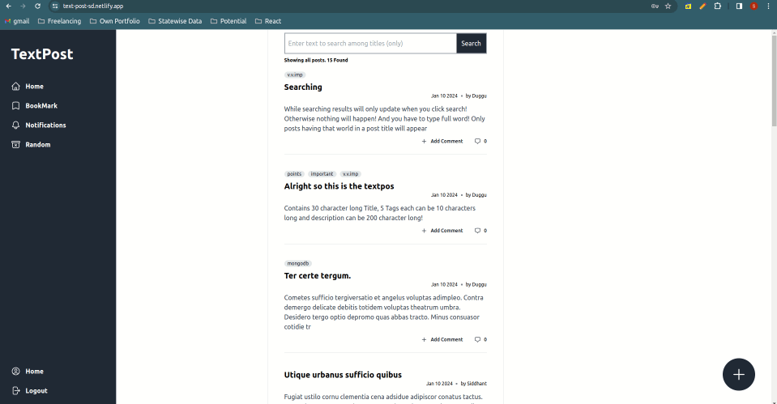

## Frontend images:

* 
* 
* 
* 
* 
* 

## Implementation:
1. Added all the features mentioned in the assignment (please see images on next page)
   1. Have authentication, 
      1. JWT-token based
      2. also saving password using bcryptjs to encrypt
   2. one user can create a text post
   3. see all the post in the feed
      1. with time of post and author who has written it
      2. post will be return in the reverse order of the time uploaded (time field indexed)
   4. add a new post
   5. read the comments of the post
   6. add a comments
   7. and search a text world it will return all the post having that world in their title
      * Title field of each post is indexed with [Text Index](https://www.mongodb.com/docs/manual/core/indexes/index-types/index-text/) 
2. In backend everything is properly validated 
  1. Focus given on security
  2. Returns proper error codes
  3. schema is designed to be scalable
  4. proper index are created for optimized query operations ( Posts.ts )
3. Typescript is used for both frontend and backend.
    
## Technologies Used:
1. Frontend:
     1. React.js
     2. TailwindCSS
     3. Flux or State management: Redux
2. Backend:
     1. Language: Node.js
     2. ORM: Mongoose
     3. Database: MongoDB
3. Authentication:
     1. JWT-token based authentication
     2. and also encrypting/hashing password with BcryptJS library
   
## Backend

1. Using 
   1. Node.js, MongoDB, JWT
   2. Framework: Express.js
   3. Library: Mongoose (ORM), express-validator, BcrypyJS
2. Routes:
   1. Index Routes (/) 
      1. Primarily used for authentication related tasks
      2. /loging
      3. /register
      4. /logout
      5. /
         1. Getting user data
   2. Post Routes (/p)
      1. To handle post related tasks
      2. POST /
      3. GET  /
         1. get posts feed
      4. GET  /s
         1. will search a field across all the titles of the post 
   3. Comment Routes (/c)
      1. Almost similar to post routes
3. Middleware:
   1. Auth:
      1. Checks jwt inside the cookie and validate it for each request
   2. Validate:
      1. Through 400 (Bad request) error if any express-validator condition fails

